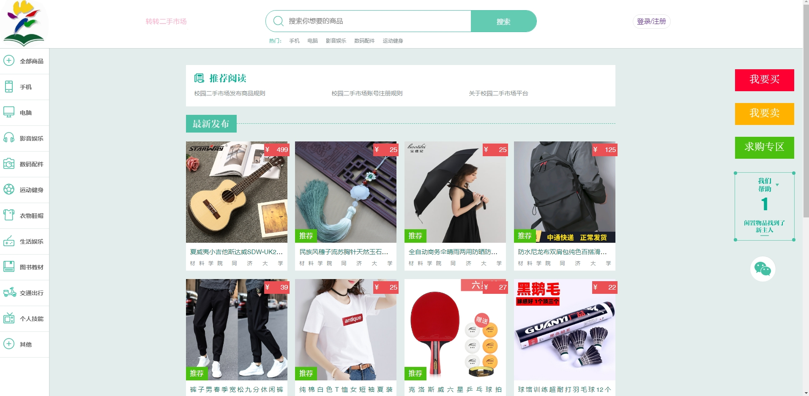
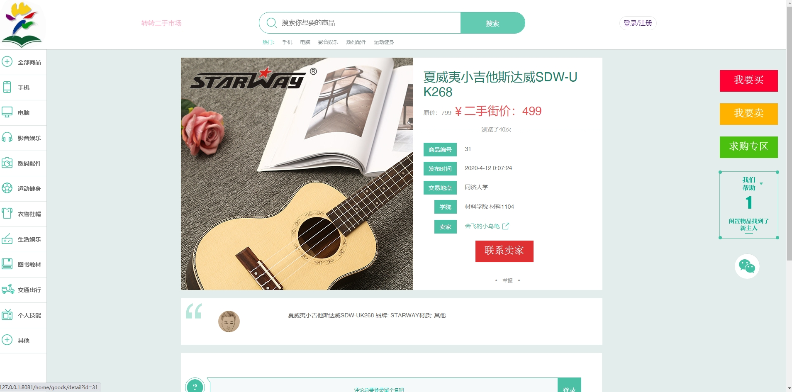
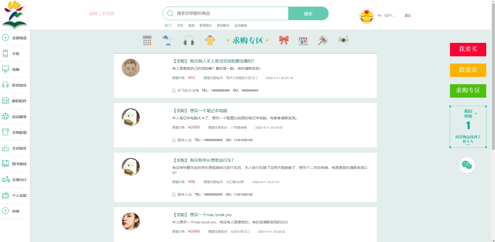
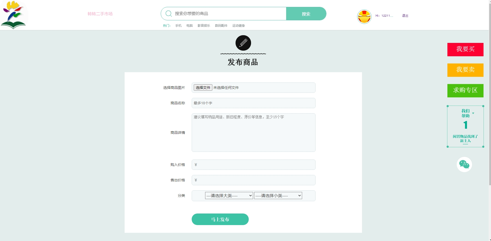
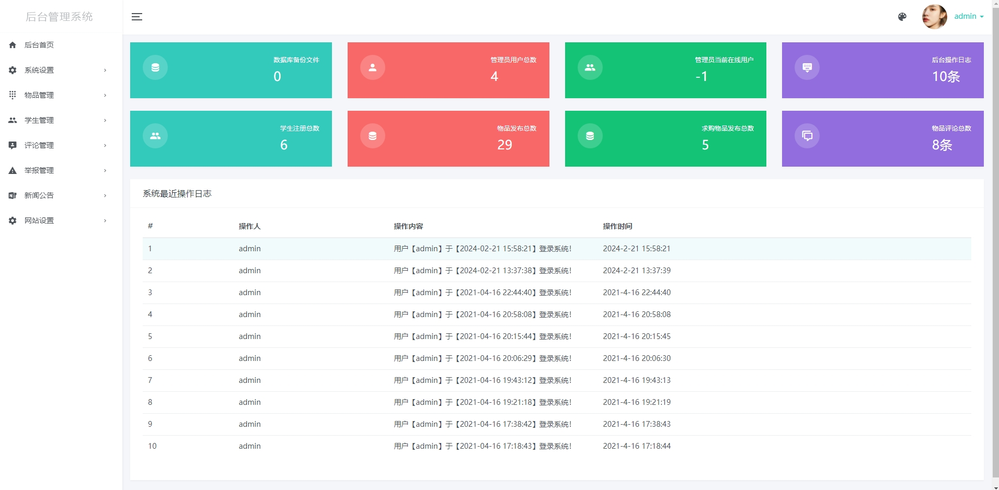

[点我获取源码](https://x-x.fun/e/NU71a66be61dE)💕🤞
[更多内容](http://blog.cyrobot.top/blog)💕🤞

#### 介绍
基于SpringBoot实现的校园二手交易平台。

技术框架：SpringBoot2.0.0 + MyBatis1.3.2 + Mysql5.7 + Bootstrap

运行环境：jdk8 + IntelliJ IDEA + maven3

后台首页、菜单管理、角色管理、用户管理、日志管理、数据备份、分类管理、物品管理、

求购物品、学生列表、评论列表、公告列表、友情链接、站点设置。

#### 安装教程

1.下载源码，本地新建数据库，导入db_campus_market.sql文件。
2.使用IDEA打开domss目录，修改数据库配置、文件路径等信息，修改路径如下：
/secondhand/src/main/resources/application-dev.properties
/secondhand/src/main/resources/application-prd.properties
3.依赖自动安装完成后，点击编辑器里的Run->App模块，如果找不到入口模块，可以手动打开以下路径运行文件中的函数：
/secondhand/src/main/java/com/mall/admin/App.java
4.项目启动成功后，访问地址：
 前台地址
http://127.0.0.1:8081/home/index/index
 后台地址
http://127.0.0.1:8081/system/login
5.默认后台账号密码：admin 123456

#### 部分截图

# 基于SpringBoot的校园二手交易平台
